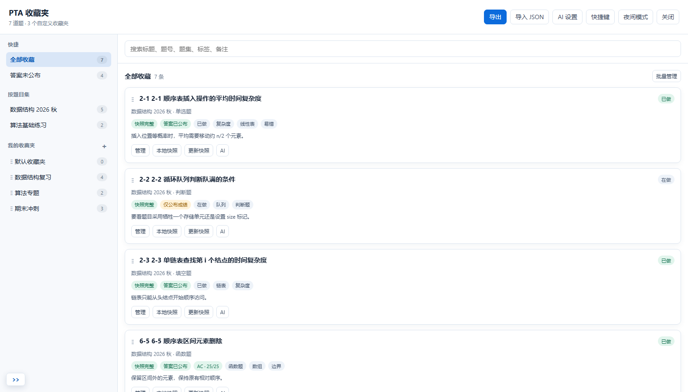
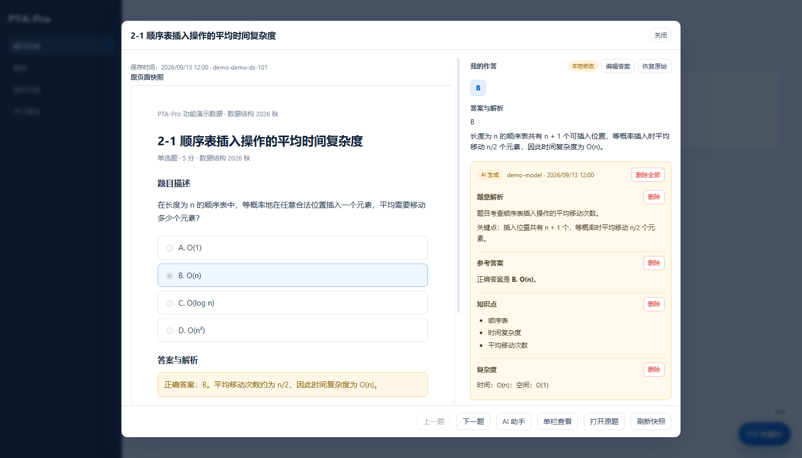
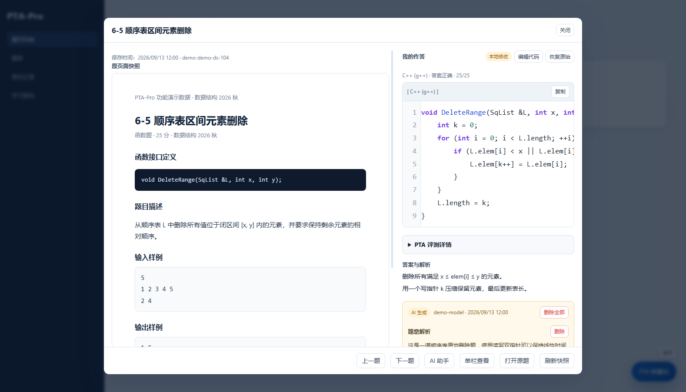
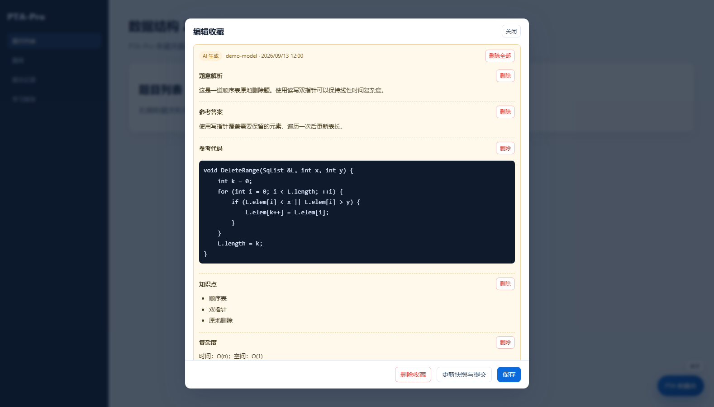
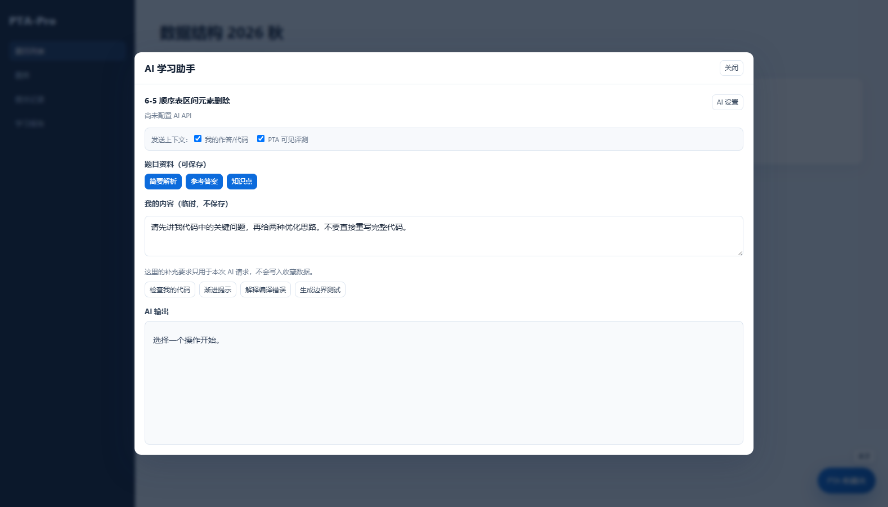
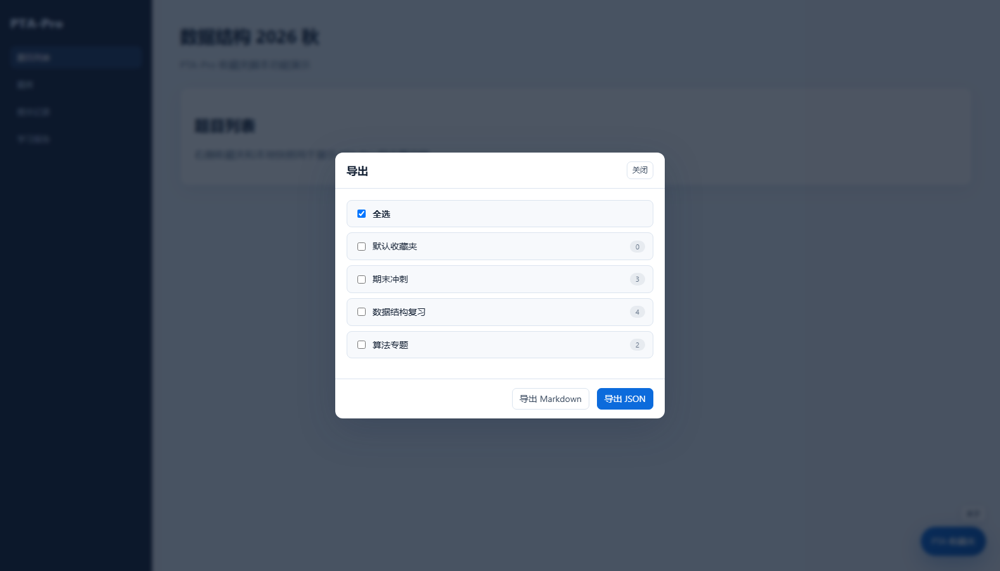
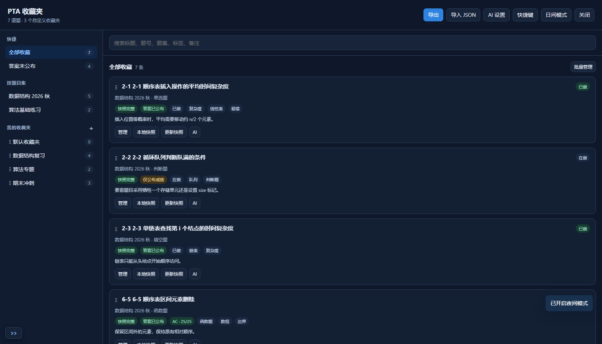
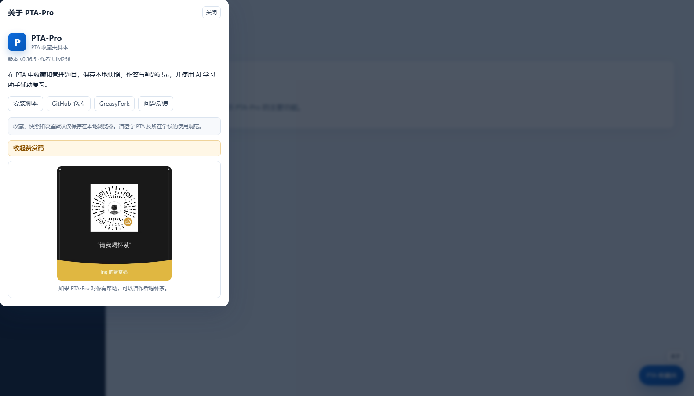

# PTA-Pro

> 一个面向 PTA（拼题A）的收藏夹油猴脚本，让题目收藏、复习整理和本地留存更可靠。

PTA-Pro 是项目名，实际安装的油猴脚本名为 **PTA 收藏夹**。脚本运行在 PTA 页面中，提供题目收藏、分类管理、本地快照、作答与代码编辑、判题记录、AI 学习助手和导入导出等功能。

> ⭐ 如果 PTA-Pro 对你的学习或复习有帮助，欢迎给项目点一个 Star。你的支持会让脚本持续维护和更新。

## 界面预览

### 收藏夹、文件夹、标签与分页



### 选择题本地快照、我的作答与参考答案



### 函数题/编程题快照、我的作答与 PTA 评测详情



### AI 生成内容可保存、按分区删除



### AI 补充要求输入框



### 按收藏夹选择性导出 JSON / Markdown



### 夜间模式



### 关于与发布地址



## 演示数据

仓库包含一份可直接导入的演示数据：[PTA-Pro功能演示数据.json](outputs/PTA-Pro功能演示数据.json)。

导入后可以查看单选、判断、填空、函数题、编程题和简答题，以及收藏夹、标签、备注、AI 解析、代码、判题记录和本地快照等核心功能。

## 主要功能

### 收藏与管理

- 在题目标题前显示收藏星标。
- 左键收藏/取消收藏，右键打开收藏管理。
- 取消收藏时同步删除对应本地快照。
- 按题目集自动归档，并支持按题型细分。
- 支持默认收藏夹和用户自定义收藏夹。
- 支持收藏夹、收藏题目的拖动排序。
- 支持分页、搜索、标签、备注和学习状态管理。
- 支持批量管理：删除、复制、移动、未做、在做、已做。

### 本地快照

- 保存题目原始页面内容与样式，计时结束后仍可本地查看。
- 快照保存在浏览器本地，不依赖 PTA 继续提供题目页面。
- 支持编辑选择题答案。
- 支持编辑编程题、函数题的“我的作答”代码。
- 支持恢复原始快照内容。
- 支持单栏和左右并排查看。
- 支持拖动调整左右分栏宽度。
- 支持上一题、下一题快速浏览。

> 快照只能在题目页面仍可查看时保存，不用于绕过考试时间限制或访问隐藏内容。

### 判题与提交记录

- 保存 PTA 可见的提交代码、编译器、状态、分数和测试点。
- 保存代码长度、时间、内存、栈等判题限制信息。
- 正确性以 PTA 判题结果为准，不在本地模拟隐藏测试点。
- 支持在快照中查看和编辑自己保存的代码。

### AI 学习助手

- 支持自定义 OpenAI 兼容 API。
- 内置 OpenAI、DeepSeek、OpenRouter、阿里云百炼、Ollama、LM Studio 等预设。
- 支持自动读取模型列表。
- 可生成题意解析、参考答案、参考代码、知识点和复杂度。
- “我的内容”支持输入本次补充要求，只用于当前 AI 请求，不保存。
- 用户代码检查、提示、编译错误解释等临时内容默认不写入收藏数据。
- 保存的 AI 内容支持 Markdown，并可分段删除。
- 不自动提交代码，不访问 PTA 隐藏测试点。

### 导出、导入与夜间模式

- 支持导出 JSON 和 Markdown。
- 支持按收藏夹选择性导出。
- 支持导入 JSON，合并已有收藏并保留用户备注。
- 支持自定义快捷键。
- 支持夜间模式和日间模式切换。


## 安装

1. 安装 [Tampermonkey](https://www.tampermonkey.net/) 或其他兼容的用户脚本管理器。
2. 从 [GreasyFork](https://greasyfork.org/zh-CN/scripts/595643-pta-%E6%94%B6%E8%97%8F%E5%A4%B9) 安装。
3. 或从 GitHub 安装：

```text
https://raw.githubusercontent.com/UIM258/PTA-Pro/main/outputs/pta-favorites.user.js
```

4. 打开 PTA 题目页面，点击标题前的星标即可收藏。

### 让 AI Agent 协助安装

如果你使用 Codex、ChatGPT、Claude、Cursor 或其他能够操作浏览器和终端的 AI Agent，可以直接把下面这段提示词发给它，让 Agent 协助完成安装：

```text
请协助我安装 PTA-Pro 的“PTA 收藏夹”油猴脚本。

目标：
1. 检查我的 Chrome 或 Edge 是否已经安装 Tampermonkey 等用户脚本管理器。
2. 如果没有安装，请打开官方安装页面，指导我完成安装。
3. 打开 GreasyFork 脚本页：
   https://greasyfork.org/zh-CN/scripts/595643-pta-%E6%94%B6%E8%97%8F%E5%A4%B9
4. 如果 GreasyFork 暂时不可用，改用 GitHub Raw：
   https://raw.githubusercontent.com/UIM258/PTA-Pro/main/outputs/pta-favorites.user.js
5. 安装完成后，打开任意 PTA 题目页面，确认标题前出现收藏星标。
6. 如果安装或更新失败，请检查用户脚本管理器的版本和更新状态，不要修改或删除我的其他脚本。

安全要求：
- 不要读取、记录或上传我的密码、Cookie、API Key 或浏览历史。
- 遇到登录、验证码或权限确认时，请暂停并让我自己操作。
- 不要自动提交 PTA 题目，不要访问隐藏测试点。
```

## 使用说明

- **左键星标**：收藏；再次左键取消收藏并删除本地快照。
- **右键星标**：打开“编辑收藏”。
- **收藏夹**：管理收藏夹、搜索题目、分页浏览和批量操作。
- **本地快照**：查看并编辑已保存的题目、答案和代码。
- **AI 设置**：配置 OpenAI 兼容 API 地址、密钥和模型。
- **导出**：导出 JSON 或 Markdown，可按收藏夹选择。
- **快捷键**：查看和自定义常用操作快捷键。

详细说明见 [使用说明](outputs/使用说明.md)。

## 数据与隐私

- 收藏、快照、设置和 AI 生成内容默认只保存在当前浏览器本地。
- AI API Key 单独保存在本地，不会写入导出的 JSON 或 Markdown。
- 使用 AI 功能时，脚本会把当前题目的必要上下文发送到你配置的 API 服务。
- 不同 PTA 域名（例如 abcde.pintia.cn 与 pintia.cn）的收藏数据互相独立；切换域名前先导出 JSON，再到新域名导入。
- 换设备或清理浏览器数据前，请先导出 JSON 备份。
- 导入 JSON 采用合并策略，不会直接覆盖已有备注。

## 开发

```bash
npm run check
```

构建产物：

```text
outputs/pta-favorites.user.js
```

项目结构：

```text
src/         用户脚本源码
tests/       核心逻辑测试
outputs/     构建产物和使用说明
build.mjs    构建脚本
```

## 合规说明

本项目用于个人学习、复习和资料整理。请遵守所在学校、PTA 及相关课程的使用规范，不要使用脚本绕过考试限制、访问隐藏测试点或自动提交答案。

## 许可证

[MIT](LICENSE)

## 请我喝杯茶

如果 PTA-Pro 对你有帮助，可以请我喝杯茶。也欢迎顺手点一个 Star，让更多同学发现这个项目。感谢你的支持。

<p align="center">
  
</p>
